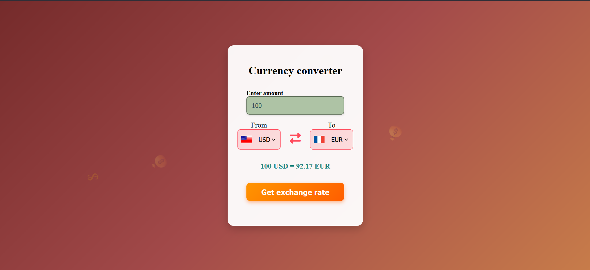

# 💱 Currency Converter

A simple and interactive Currency Converter Web App that fetches real-time exchange rates and updates country flags based on selected currencies. Built with HTML, CSS, and JavaScript using public APIs.

<!-- Replace with your actual screenshot filename -->


## 🚀 Features

- Convert between any two currencies
- exchange rates using Fawaz Ahmed’s Currency API
- Dynamic country flag updates
- Smooth user interface with a fun raining money effect

## 🛠️ Tech Stack

- HTML
- CSS
- JavaScript
- Font Awesome
- Flags API
- Fawaz Ahmed Currency API

## 📁 Folder Structure
```
currency-converter/
├── index.html
├── style.css
├── script.js
├── codes.js # contains the countryList object
├── gold-coin.svg # favicon
└──  screenshot.png # optional screenshot
```

## 🧠 How It Works

- User enters an amount 
- Select "From" and "To" currencies
- App fetches exchange rate
- Flags update based on selected currencies
- Result is displayed dynamically

## ⚙️ Setup Instructions

### Step-1 Clone the repository

```git clone https://github.com/your-username/currency-converter.git cd currency-converter```

### Step-2 Open in browser

open index.html

## 📦 Dependencies

- No build tools or frameworks required
- Only needs internet connection for:
  - Fetching exchange rates
  - Loading country flags
  - Font Awesome icons

## 🙌 Acknowledgments

- Fawaz Ahmed's Free Currency API
- Flags API
- Font Awesome

## 🪙 Raining Money Animation

Just a fun little UI effect with 💸, 💰, 🪙 emojis floating down the screen for some ✨drip✨.

## 👨‍💻 Created By
**Hardik Jindal**
